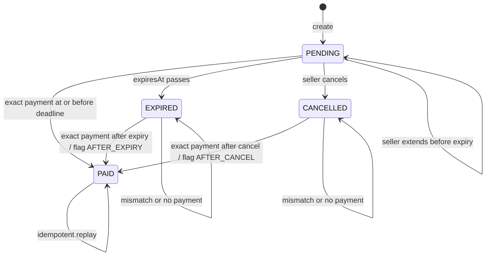

# Invoice expiry, cancellation, and late on-chain payment policy

Status: product decision for the freelancer MVP. Issue #417 implements the
cancel-versus-payment settlement slice. The broader after-expiry and extension
behavior remains a follow-up.

## Decision

Keep expiresAt in the near-term release with a seven-day default and the
existing seller-selected 1–30 day range. Expiry prevents a forgotten payment
request from remaining actionable forever. Cancellation remains a separate
seller action.

A matching Stellar payment is evidence that funds reached the seller even when
it arrived after expiry or cancellation. Verification must therefore
accept-and-flag an exact late payment. It must not report the invoice as unpaid
or discard the transaction. The resulting invoice is PAID and carries an
immutable settlement context:

- ON_TIME
- AFTER_EXPIRY
- AFTER_CANCEL

The previous terminal state and its timestamp remain in the audit event.
Receipt and proof views show the late-payment warning. This records what
happened on-chain without implying that the seller approved late performance.

Classification uses the transaction's ledger close time, not the time Horizon
was queried. A payment included before expiresAt is ON_TIME even if a restart
causes verification after expiry. Cancellation requires a new cancelledAt
timestamp; without it, an after-cancel payment cannot be classified reliably.

## State diagram



There is no transition from EXPIRED or CANCELLED back to PENDING. Extension is
allowed only while PENDING. There is no reopen action in the MVP.

## Transition rules

| Current state | Event | Result | Settlement context | User-facing behavior |
| --- | --- | --- | --- | --- |
| PENDING | exact payment with ledger time at or before expiresAt | PAID | ON_TIME | normal proof |
| PENDING | expiresAt passes | EXPIRED | none | hide pay controls |
| PENDING | seller cancels | CANCELLED | none | hide pay controls |
| PENDING | seller extends before expiry | PENDING | none | show new deadline |
| EXPIRED | exact payment with ledger time after expiresAt | PAID | AFTER_EXPIRY | proof with warning |
| EXPIRED | payment was on-chain before expiresAt but detected later | PAID | ON_TIME | normal proof |
| CANCELLED | exact payment after cancelledAt | PAID | AFTER_CANCEL | proof with warning |
| CANCELLED | payment was on-chain before cancelledAt but detected later | PAID | ON_TIME | normal proof |
| Any non-PAID state | memo, destination, amount, asset, issuer, or network mismatch | unchanged | none | reject verification |
| PAID | same transaction replayed | PAID | unchanged | idempotent success |
| PAID | different transaction | PAID | unchanged | reject duplicate settlement |

Exact means the existing verification contract passes memo, destination,
seven-decimal amount, asset code and issuer, and network checks. A partial
payment does not settle the invoice and is not aggregated with later payments
in the MVP.

## Verify API behavior

The verify path must fetch the transaction before rejecting an apparently
expired or cancelled invoice, because transaction time decides whether the
payment was late. Recommended responses are:

### On-time payment

HTTP 200, normal paid invoice response.

```json
{
  "success": true,
  "data": {
    "status": "PAID",
    "settlementContext": "ON_TIME"
  }
}
```

### Exact late payment

HTTP 200 because the payment exists and the proof is valid. Include a stable
warning code so every client can show the same message.

```json
{
  "success": true,
  "code": "PAYMENT_RECEIVED_AFTER_EXPIRY",
  "warning": "Payment was received after this invoice expired.",
  "data": {
    "status": "PAID",
    "settlementContext": "AFTER_EXPIRY"
  }
}
```

Use PAYMENT_RECEIVED_AFTER_CANCEL for the cancellation case. A 4xx response is
reserved for a transaction that does not match or cannot settle this invoice.
Returning INVOICE_EXPIRED before looking up the transaction would hide real
funds and is not the recommended policy.

## Proof wording

### Paid after expiry

> Payment received after invoice expiry
>
> This payment settled on Stellar at 2026-09-13 14:32 UTC. The invoice expired
> at 2026-09-12 23:59 UTC. The transaction proves that funds reached the seller;
> it does not change the original due date or confirm acceptance of late
> performance.
>
> Transaction: 64-character transaction hash

### Paid after cancellation

> Payment received after cancellation
>
> This payment settled on Stellar at 2026-09-13 14:32 UTC. The seller cancelled
> the payment request at 2026-09-13 12:00 UTC. The transaction proves that funds
> reached the seller. Contact the seller to reconcile the payment.
>
> Transaction: 64-character transaction hash

The proof keeps the original invoice status event, expiry or cancellation
timestamp, ledger settlement time, amount, asset identity, memo, destination,
payer when available, and transaction hash. The title remains Payment Proof,
rather than Paid on time.

## Seller choices

| Choice | MVP recommendation |
| --- | --- |
| Leave open | default seven days; seller may choose 1–30 days at creation |
| Extend | allow once or repeatedly while PENDING, up to a documented maximum |
| Cancel | immediate terminal action; require confirmation and record cancelledAt |
| Reopen | omit; issue a new invoice with a new memo |
| Ignore a late payment | do not hide it; show it as received and flagged |
| Refund | manual reconciliation outside Quittance; no automated promise |

The pay page should stop presenting QR, wallet, and verify controls after expiry
or cancellation. It should still explain that already-submitted transactions
can be checked and provide a transaction-hash verification entry. This covers
a payer who signed just before the deadline and whose transaction closed near
the boundary.

## Data required by the follow-up

Add these fields without replacing the four public lifecycle states:

| Field | Purpose |
| --- | --- |
| cancelledAt | compare cancellation with ledger close time |
| settlementContext | ON_TIME, AFTER_EXPIRY, or AFTER_CANCEL |
| settledAt | Horizon ledger close time |
| priorStatus | audit value captured when settlement changes a terminal state |
| latePaymentWarningCode | stable API and proof copy selection |

Store the transition and tx hash in one database transaction. The automatic
monitor and manual verify endpoint must call the same policy function.

## Boundary and failure cases

- If Horizon has no trustworthy close time, keep the invoice unchanged and
  return a retryable verification error.
- Compare UTC instants. Display timezone conversion is a client concern.
- At exactly expiresAt, treat the invoice as expired and a payment at that same
  instant as late. This matches the current expires_at > NOW() payment guard.
- At exactly cancelledAt, classify the payment as after cancellation.
- A chain reorg or failed transaction never creates a payment proof.
- Overpayment is rejected under the current exact-amount contract and is
  reported as `AMOUNT_TOO_HIGH` (underpayment is `AMOUNT_TOO_LOW`); record both
  for reconciliation but do not silently settle.
- The policy records receipt only. It does not promise a refund, clawback, or
  legal discharge.

## Implementation acceptance

1. Unit-test every row in the transition table with an injected UTC clock.
2. Run the same cases against memory and Postgres storage.
3. Verify detection after a restart uses ledger close time.
4. Assert late payments produce PAID plus the correct context and proof copy.
5. Assert mismatches leave EXPIRED or CANCELLED unchanged.
6. Assert seller list and stats count received funds once.
7. Assert replaying the same tx hash cannot create a second event or proof.
